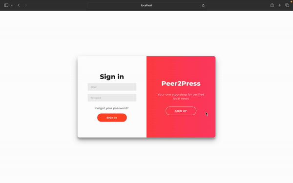
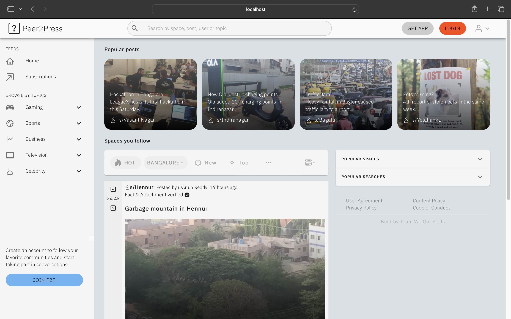

# Peer2Press

Peer2Press is a peer-to-peer news application that emerged as a result of a hackathon conducted by LeagueX Gaming. On P2P, users can actively share and engage with local news happening around them. On this platform, users can share images of local events, and the application will fact-check and verify the authenticity of the news broadcasted.

## Login/Signup page


<br>
<br>

## Home page


<br>
<br>

---
<br>

## Cloning the repository

--> Clone the repository:

```bash
git clone https://github.com/MujeerAhmed/Peer2Press.git
```

--> Move to the project's directory:

```bash
cd Peer2Press
```

--> Install dependencies:

```bash
npm i --force
```

--> Start project:

```bash
npm start
```

> ⚠ The UI will be accessible at localhost:3000/login and localhost:3000/home
